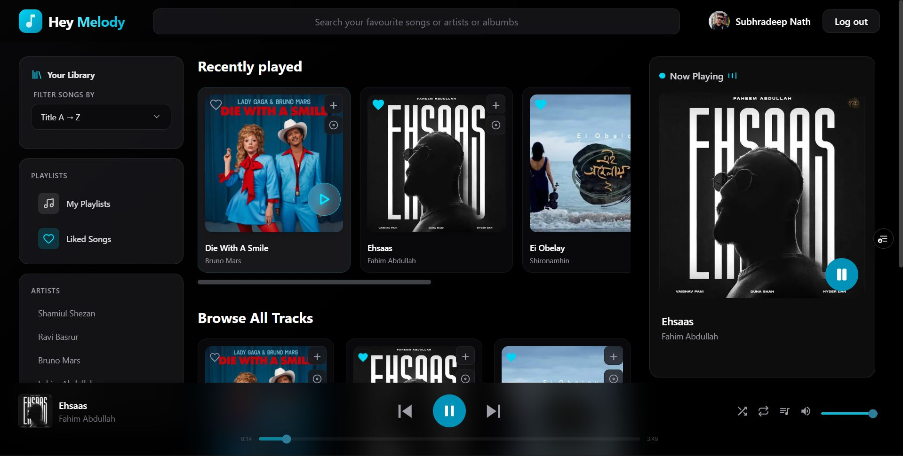
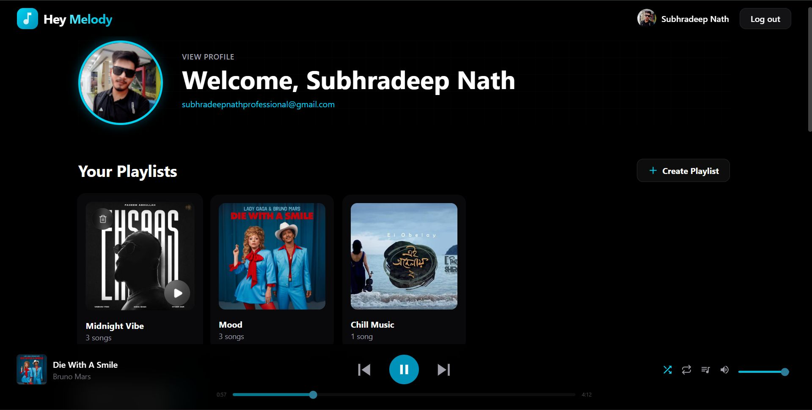
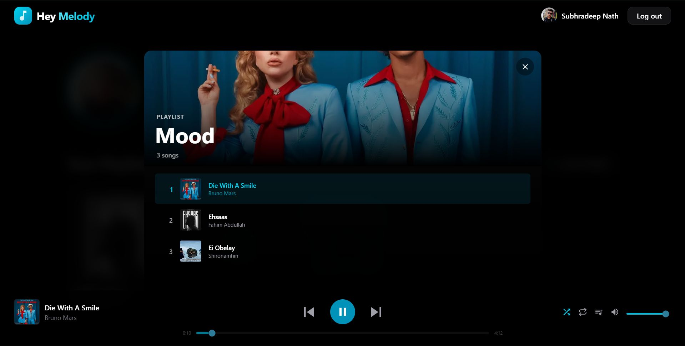
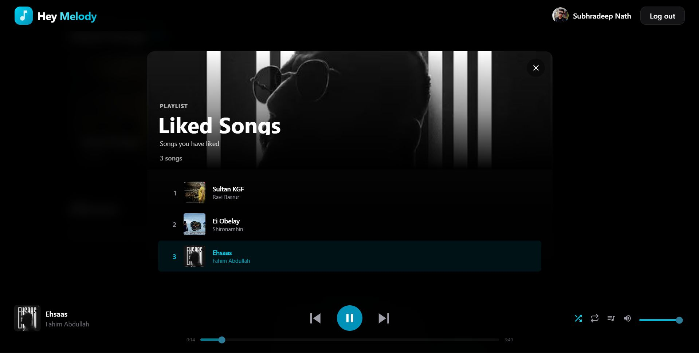
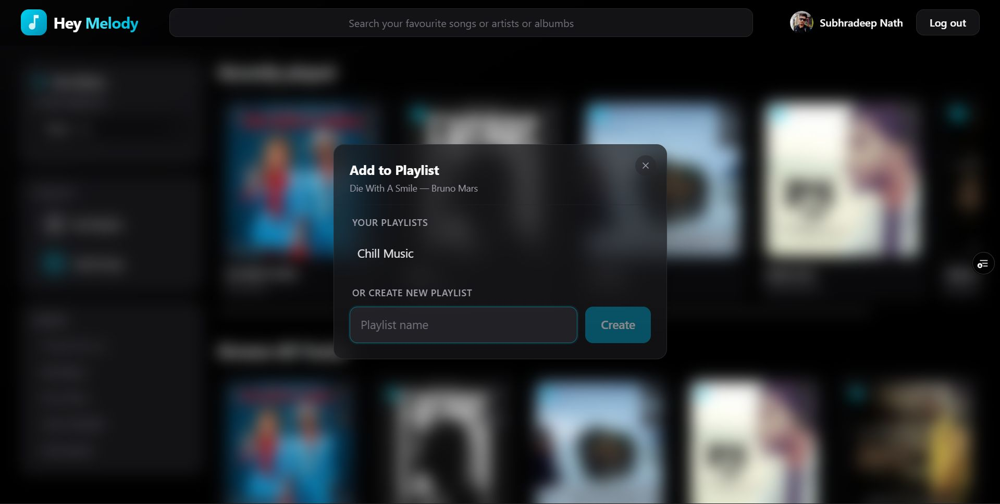
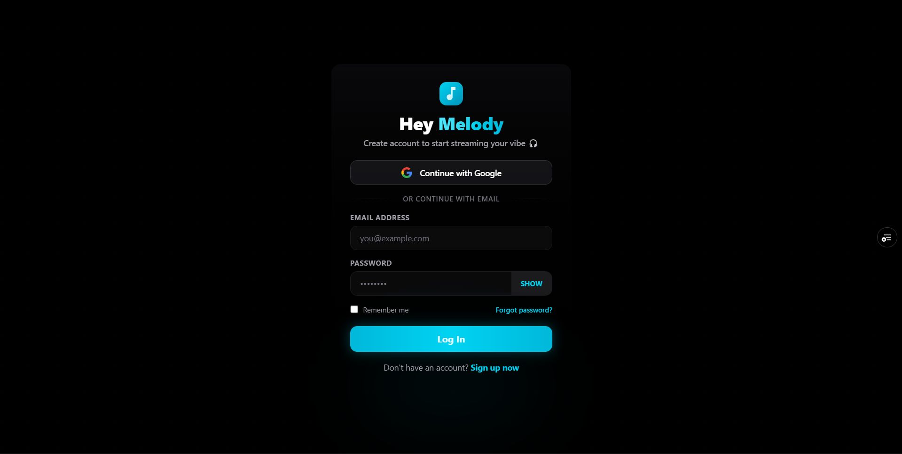
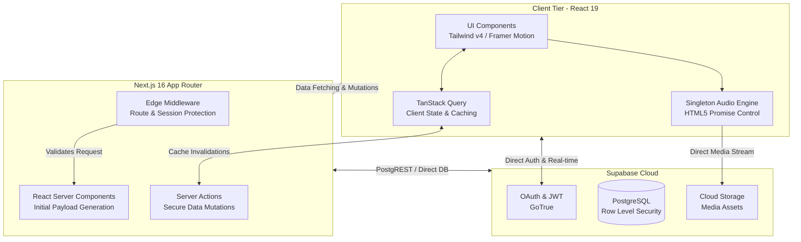

<div align="center">

# HeyMelody: Enterprise Music Streaming Platform

**HeyMelody** is a high-fidelity music streaming platform engineered for performance, scalability, and a seamless user experience. Built on the **Next.js 16 App Router**, it delivers near-instantaneous route transitions, real-time data synchronization, and a custom-built, resilient audio engine.

</div>

---

## Interface & User Experience

The application features a modern, glassmorphic design system tailored to provide an immersive listening environment without compromising on accessibility or performance.

<p align="center">
  
</p>
<p align="center">
  
  
</p>
<p align="center">
  
  
</p>
<p align="center">
  
  
</p>

---

## System Architecture

HeyMelody is designed with a decoupled architecture, clearly separating the presentation layer, server-rendering layer, and the backend-as-a-service (BaaS) data tier. This ensures horizontal scalability and maintainability.



### Architectural Highlights
- **Edge-First Security**: Next.js Middleware acts as the primary gatekeeper. Every request is validated at the Edge, ensuring unauthenticated requests are intercepted before reaching protected Server Components, reducing unnecessary server load.
- **Client-Server Hybrid Rendering**: Utilizing React 19 Server Components (RSC), the initial HTML payload is generated on the server for optimal Time-to-First-Byte (TTFB) and SEO. The client subsequently assumes control using TanStack Query for highly interactive, state-driven components.
- **Row Level Security (RLS)**: The Supabase PostgreSQL database enforces strict access policies at the engine level, guaranteeing that data mutations (such as favoriting a track) are securely restricted to the authenticated user's UUID.

---

## Core Application Workflow

The application lifecycle is divided into four optimized phases to ensure a flawless user journey from authentication to audio playback.

### Phase 1: Authentication & Session Management
1. **Initial Access**: Users access the landing page, which is statically optimized.
2. **OAuth Integration**: Authentication is handled via Supabase OAuth 2.0 (Google integration).
3. **Session Establishment**: Upon successful authentication, a secure JSON Web Token (JWT) is issued and persisted in HTTPOnly cookies.
4. **Edge Validation**: Navigation to protected routes (e.g., `/home`) triggers the Next.js Middleware, which verifies the JWT signature at the Edge before granting access.

### Phase 2: Navigation & Data Hydration
1. **Server-Side Rendering (SSR)**: Core dashboard views are pre-rendered on the server. Track metadata and user profiles are queried from PostgreSQL without requiring initial client-side JavaScript execution.
2. **Client-Side Routing**: Subsequent navigation between primary modules utilizes Next.js soft-navigation.
3. **Dynamic Viewports**: To handle variable-length metadata, Intersection Observers detect text overflow and dynamically apply CSS marquee animations, ensuring UI integrity.

### Phase 3: Audio Pipeline Execution
1. **Playback Initiation**: Selecting a track dispatches a global state update to the central `PlayerContext`.
2. **Singleton Interception**: The custom Audio Engine receives the media URL. Rather than instantiating new DOM nodes—which introduces latency—it seamlessly updates the `src` attribute of the existing global `<audio>` element.
3. **Race Condition Mitigation**: The engine safely wraps the `.play()` method in a promise handler. Rapid consecutive track selections are caught and gracefully aborted to prevent `AbortError` exceptions and overlapping audio streams.
4. **State Synchronization**: The global context broadcasts the "playing" state to all active components, instantly syncing visualizers and playback controls.

### Phase 4: State Mutations & Optimistic Updates
1. **User Interaction**: Interactions such as favoriting a track trigger immediate optimistic UI updates via TanStack Query.
2. **Server Mutation**: A Next.js Server Action asynchronously transmits the mutation to the database.
3. **Cache Invalidation**: Upon successful database confirmation, the relevant cache keys are invalidated. This mechanism instantly synchronizes the state across all active browser tabs for the current session.

---

## Engineering & Core Functionalities

### High-Performance Audio Engine
*   **Gapless Playback Architecture**: Engineered to handle rapid user inputs without audio dropouts.
*   **Persistent Preferences**: The application leverages state hydration combined with `localStorage` to persist user settings (e.g., volume levels and repeat toggles) across sessions.
*   **Algorithmic Shuffle**: Utilizes a proprietary randomization algorithm designed to prevent immediate track repetition, resolving the common "true random" clustering issue in standard implementations.

### Real-Time State Management
*   **TanStack Query Implementation**: Acts as the centralized remote state manager. It significantly optimizes network utilization by caching data locally and polling/refetching only upon cache invalidation or staleness.
*   **Global Context**: Eliminates prop-drilling by utilizing React Context for global state, ensuring nested components can trigger top-level state changes efficiently.

### UI/UX Architecture
*   **Utility-First CSS**: Built with Tailwind CSS 4 to provide a responsive, grid-based layout adaptable to mobile, tablet, and desktop viewports natively.
*   **Hardware-Accelerated Animations**: Transitions and micro-interactions are managed by Framer Motion, utilizing the GPU to maintain 60 FPS performance.
*   **Zero-CLS Rendering**: Media assets (such as cover art) are implemented with strict layout priorities and aspect ratios to prevent Cumulative Layout Shift, ensuring a stable visual hierarchy during network loads.

---

## Technology Stack

The platform is constructed using industry-standard, modern web technologies:

| Layer | Technology | Justification |
| :--- | :--- | :--- |
| **Framework** | Next.js 16 (App Router) | Provides optimized rendering strategies (RSC, SSR) and edge computing capabilities. |
| **UI Library** | React 19 | Facilitates concurrent rendering and minimizes client-side JavaScript bundles via Server Components. |
| **Backend & Auth** | Supabase | Delivers a managed PostgreSQL instance, integrated Row Level Security, and compliant OAuth flows. |
| **Styling** | Tailwind CSS 4 | Enables highly maintainable, scalable, and atomic CSS architecture. |
| **State Management**| TanStack Query v5 | The industry standard for robust server-state caching, synchronization, and optimistic updates. |
| **Animations** | Framer Motion | Ensures performant, declaratively defined animations across the DOM. |

---

## Developer Setup & Installation

### Prerequisites
- **Node.js**: `v20.x` or higher
- **Package Manager**: `npm` or `pnpm`

### Environment Configuration
Create a `.env` file in the root directory containing the required Supabase parameters:
```env
NEXT_PUBLIC_SUPABASE_URL=your_project_url
NEXT_PUBLIC_SUPABASE_ANON_KEY=your_anon_key
```

### Installation
Execute the following commands to initialize the development environment:

```bash
# Clone the repository
git clone https://github.com/SubhradeepNathGit/Hey-Melody.git

# Navigate to the project directory
cd Hey-Melody

# Install dependencies
npm install

# Start the development server
npm run dev
```

---

## License & Copyright

**© 2025 - 2026 Subhradeep Nath. All Rights Reserved.**

**Developer**: Subhradeep Nath  
**Project**: HeyMelody Music Streaming Platform

*This source code is provided for demonstration and portfolio purposes. Unauthorized reproduction, distribution, or commercial use of this codebase is strictly prohibited.*
